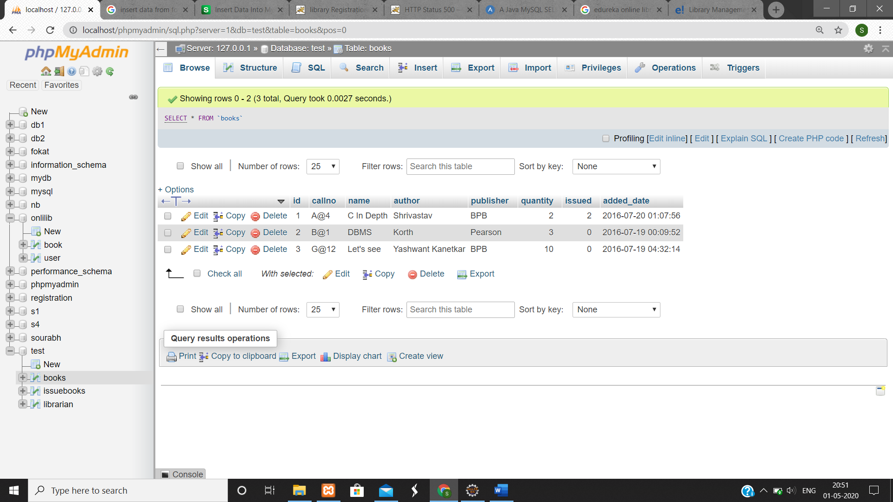

# online-lib1

users of system: there are two users of system     
	      1) Admin.    
	      2) user.
                  
 Functional requiremments of user:
1) User needs to sign-up in the sytem first.
2) Then he needs tp login using his email-id and password

Tools used :
1) Eclipse IDE.
2) Mysql for database.
3)xampp server

How Projects work?

Project contains admin panel and for  users panel.
before entering one should enter admin name and password
one can perform varipus functions then like view books, add books,view issued books,reurn book

Class diagram:

Dataflow diagram:

Activity digram:

ER diagram:

Sequential diagram:

